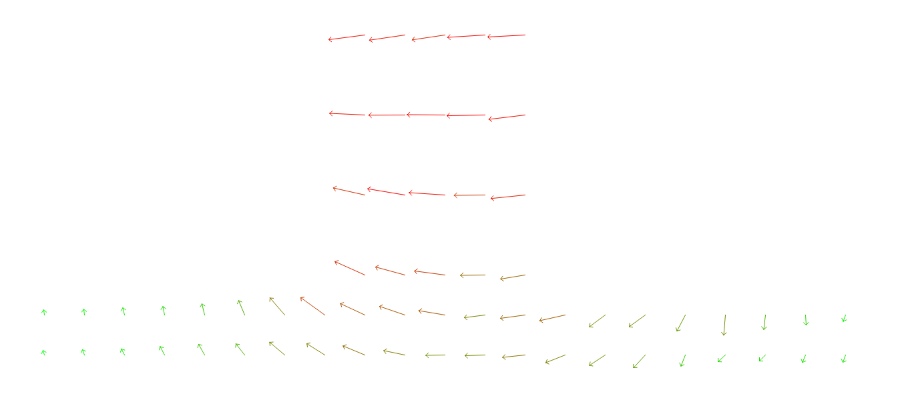
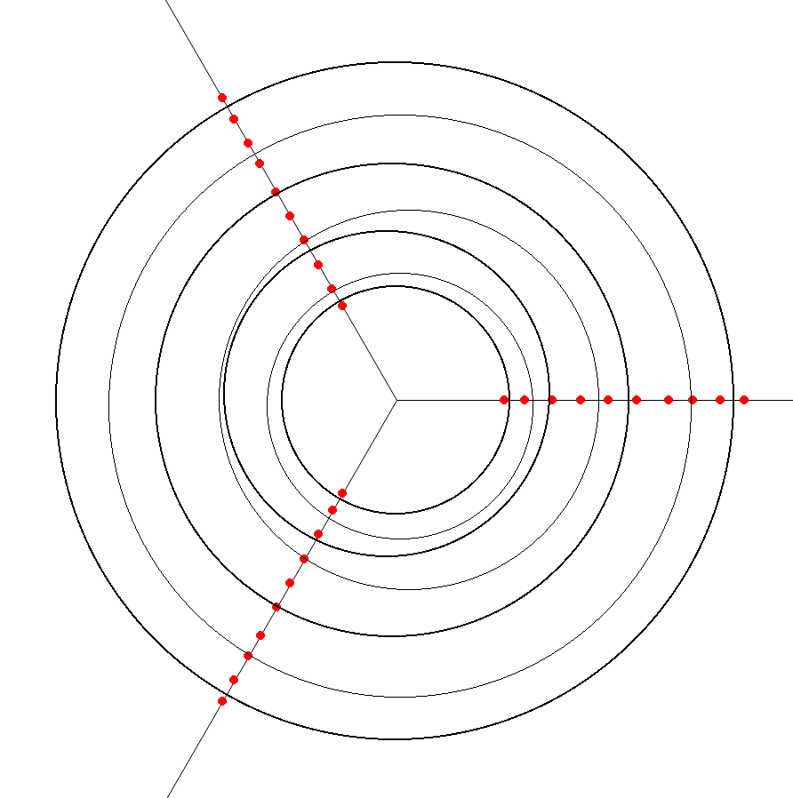

# Vector-Field-Modelling
PyGame visualisation of a Vector Field, which is designed for Physics Labolatory no. 31 in AGH UST Computer Science curriculum

- [Laboratory Description](readme-assets/lab_description.pdf) `(.pdf in polish)`
- [Laboratory Report Template](readme-assets/report_template.pdf) `(.pdf in polish)`

Source: [Pracownia Fizyczna, Wydział Fizyki i Informatyki Stosowanej](http://website.fis.agh.edu.pl/~pracownia_fizyczna/index.php?p=cwiczenia)

## Example visualizations

### Plate capacitor electric field


### Circular capacitor electric field



## How to generate

### Initial setup
- Verify you have python 3 installed by running `python3 --version`
- Verify you have `pip` installed by running `pip --version`
- Install pygame by running `pip install pygame`


### Plate capacitor
- Put your readings into `plate_capacitor/readings.txt`. Type of whitespace characters shouldn't make any difference, bacause readings form is defined separately
- (Optionally) Chose one of the ready graphical settings in `plate_capacitor/config.py`
- (Optionally) Feel free to add new or modify existings graphical settings in `plate_capacitor/Graphical_settings.py`
- Run `python3 plate_capacitor/run.py`

If readings were read succesfully, something like that should appear in the console:
```
Read field:
                                             1.3  1.45  1.58
                                            1.32  1.49  1.65
                                            1.34  1.55  1.73
                                            1.39  1.64  1.89
                                            1.44  1.77  2.09
                                            1.52  1.95  2.28
                                             1.7  2.21  2.59
                                            2.14  2.66   3.0
  2.22        1.94        2.04        2.46  2.86   3.2  3.47
   3.3        2.99        2.98        3.35  3.59  3.85  3.98
  4.36        4.07        4.09        4.23  4.35  4.48  4.47
  5.34         5.2        5.16        5.14  5.13  5.05  5.03
  6.46        6.34        6.08        5.87  5.75  5.65  5.58
  7.58        7.42         7.1         6.6  6.49  6.32  6.09
                                            7.25   6.9  6.59
                                            7.72  7.37  6.99
                                             8.2  7.72  7.39
                                            8.45  7.85  7.65
                                             8.5  8.07  7.89
                                            8.55  8.25  8.03
                                            8.53  8.34  8.12
                                             8.6  8.42  8.21
```


### Plate capacitor
- Put your readings into `circular_capacitor/readings.txt`. Format of this file is as follows:
  - Column 1: `Distance from the middle of n-th point (cm)`
  - Column 2: `Electric potential of n-th point on line I` | 
  - Column 3: `(...) on line II`
  - Column 4: `(...) on line II`

- Set value-related settings in `circular_capacitor/config.py` in accordance with comments
- (Optionally) Modify display options in `circular_capacitor/config.py`
- Run `python3 circular_capacitor/run.py`

If readings were read succesfully, something like that should appear in the console:
```
Loaded radiuses:
[27.0, 32.0, 39.0, 46.0, 53.0, 60.0, 68.0, 74.0, 81.0, 87.0]

Loaded readings:
Column 1:  [6.7, 6.1, 4.6, 4.3, 3.6, 2.7, 2.3, 2.0, 1.4, 0.9]
Column 2:  [6.9, 5.9, 5.0, 3.8, 3.5, 2.9, 2.2, 1.8, 1.4, 1.0]
Column 3:  [7.2, 5.4, 5.2, 4.4, 3.2, 2.9, 2.3, 1.7, 1.3, 1.0]
```


## Other capacitors (*)
  *Other capacitors are not implemented, but can be generated, by setting `structure` parameter of class `Data_reader`. See how `BASIC_STRUCTURE` is defined. Baisically if you have readings:
  ```
                   2.28
             2.21  2.59
             2.14  2.66
  2.04       2.14  2.46
  ```
  then:
  ```
  structure = [
    [False, False, False, True],
    [False, False, True,  True],
    [False, False, True,  True],
    [True,  False, True,  True],
  ]
  ```